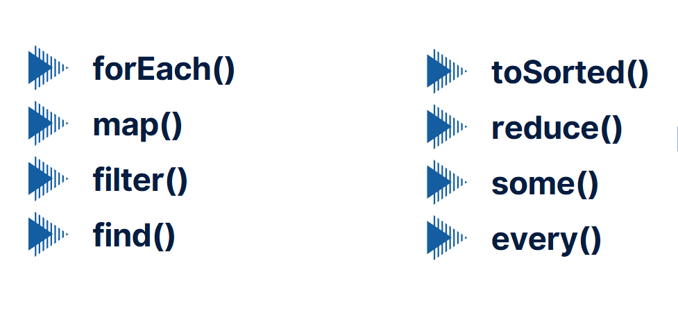

# JS - CALLBACK & CALLBACK - METHODS


---

# Callback дар JavaScript


## Чи маъно дорад Callback?
# **Callback** (баргардондани функсия) — ин функсия аст, ки ба функсияи дигар ҳамчун аргумент дода мешавад ва баъдтар, ҳангоми иҷрои он функсия, иҷро мешавад. Callbackҳо дар JavaScript васеъ истифода мешаванд, бахусус дар барномасозии асинхронӣ, барои иҷрои амалиёт пас аз анҷомёбии амалиёти дигар.

# Мисоли Callbacks
```javascript
function greet(name, callback) {
    console.log(`Салом, ${name}!`);
    callback();
}

function sayGoodbye() {
    console.log("Хай то дидоор!");
}

// Вақте ки callback истифода мешавад
greet("Андрей", sayGoodbye);// Салом Андрей Хай то дидор
```

# Js Callback - methods


# .forEach() 
# Метод `forEach()` дар JavaScript

# Методи `forEach()` дар JavaScript барои итератсия бар рӯи элементҳои массив истифода мешавад.

### Синтаксис:

# array.forEach(function(element, index, array) {
 #   // Код барои кор кардан бо element
# });

# examples
```js
const fruits = ["apple", "banana", "cherry"];

fruits.forEach(function(fruit) {
    console.log(fruit); // apple banana cherry
});
```

---
---

# Метод `map()` дар JavaScript

# Методи `map()` дар JavaScript барои итератсия бар рӯи элементҳои массив ва баргардонидани массиви нав бо элементҳои ивазшуда истифода мешавад.

### Синтаксис:

# let newArray = array.map(function(element, index, array) {
#    // Код барои кор кардан бо element
    return newElement;
# });

# Example 
```js
const numbers = [1, 2, 3, 4, 5];

let doubledNumbers = numbers.map(function(number) {
    return number * 2;
});

console.log(doubledNumbers); // [2, 4, 6, 8, 10]

```

---

---

# Метод `filter()` дар JavaScript

# Методи `filter()` дар JavaScript барои филтратсияи элементҳо аз массив ва баргардонидани массиви нав, ки танҳо элементҳои мувофиқро дарбар мегирад, истифода мешавад.

### Синтаксис:
# let newArray = array.filter(function(element, index, array) {
#    // Шарт барои филтратсия
    return condition;  // true ё false
# });

# Example
```js
const numbers = [1, 2, 3, 4, 5, 6];

let evenNumbers = numbers.filter(function(number) {
    return number % 2 === 0;
});

console.log(evenNumbers); //[2, 4, 6]
```
---
---

# Метод `find()` дар JavaScript

# Методи `find()` дар JavaScript барои ёфтани аввалин элементе, ки бо як шарт мувофиқ аст, дар массив истифода мешавад. Вақте ки элементе, ки мувофиқ аст, пайдо шуд, метод зуд ба он таваҷҷӯҳ мекунад ва онро бармегардонад.

### Синтаксис:

# let foundElement = array.find(function(element, index, array) {
#    // Шарт барои ёфтани элемент
    return condition;  // true ё false
# });
# Example


```js
const numbers = [1, -3, 5, -7, 9];

let firstPositive = numbers.find(function(number) {
    return number > 0;
});

console.log(firstPositive); // 1
```

# Метод `toSorted()` дар JavaScript

# Методи `toSorted()` дар JavaScript барои тартиб додани элементҳои массив бо тартиби аслан кӯчишударо истифода мешавад, ки як массиви нав бо тартибшудаи элементҳоро бармегардонад, бе он ки массиви аслӣ тағйир ёбад.

#  Метод `toSorted()` дар JavaScript нав ва муодили `sort()` аст, аммо бо фарқият: он массиви аслӣ тағйир намедиҳад, балки як массиви нав бармегардонад.

### Синтаксис:

# let sortedArray = array.toSorted(compareFunction);

# Example 
```js
const numbers = [5, 3, 8, 1, 2];

let sortedNumbers = numbers.toSorted();

console.log(sortedNumbers); //[1, 2, 3, 5, 8]
```

# Метод `reduce()` дар JavaScript

# Методи `reduce()` дар JavaScript барои ба як натиҷа кӯчондани тамоми элементҳои массив истифода мешавад. Он як амалро бар ҳамаи элементҳои массив анҷом медиҳад ва як арзиши ягона бармегардонад.

### Синтаксис:

# let result = array.reduce(function(accumulator, currentValue, index, array) {
#    // Код барои ҷамъ кардан ё амали дигар
#    return newAccumulator;
# }, initialValue);

# Example 
```js
const numbers = [1, 2, 3, 4, 5];

let sum = numbers.reduce(function(accumulator, currentValue) {
    return accumulator + currentValue;
}, 0);

console.log(sum); // 15
```

# Метод `some()` дар JavaScript

# Методи `some()` дар JavaScript барои санҷидани он истифода мешавад, ки оё ҳадди ақалл як элемент дар массив бо шарти дода шуда мувофиқ аст. Агар ягон элемент бо шарти дода шударо пайдо кунад, функсия `true` бармегардонад, ва агар на, `false`.

### Синтаксис:

# let result = array.some(function(element, index, array) {
#    // Шарт барои санҷидан
#    return condition;  // true ё false
# });

# Example 
```js
const numbers = [1, 2, 3, 4, 5];

let hasNegative = numbers.some(function(number) {
    return number < 0;
});

console.log(hasNegative); // false
```
---
---

# Метод `every()` дар JavaScript

# Методи `every()` дар JavaScript барои санҷидани он истифода мешавад, ки оё ҳамаи элементҳои массив бо шарти додашуда мувофиқ мебошанд. Агар ҳамаи элементҳо бо шарти додашуда мувофиқат кунанд, функсия `true` бармегардонад, дар ғайри ҳолат `false`.

### Синтаксис:

# let result = array.every(function(element, index, array) {
#    // Шарт барои санҷидан
#    return condition;  // true ё false
# });


# Example
```js
const numbers = [1, 3, 5, 7, 9];

let allPositive = numbers.every(function(number) {
    return number > 0;
});

console.log(allPositive); // true
```


# Бо ҳамин тамом ташаккури зиёд 


# Барои маълумоти бештар гирифтан ба [линки](https://www.canva.com/design/DAGV_EGjpi0/DajiBoHG2rYEoJxDg8AD9Q/view?utm_content=DAGV_EGjpi0&utm_campaign=designshare&utm_medium=link&utm_source=editor#3) зерин пахш кунед


